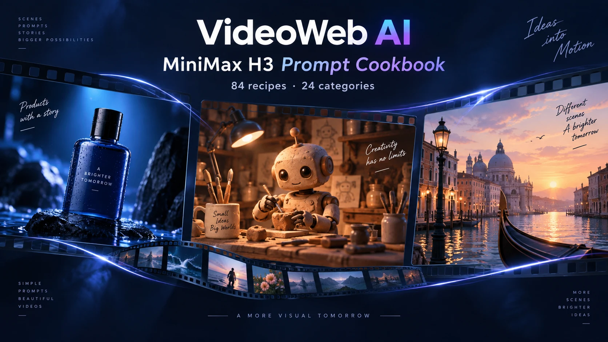
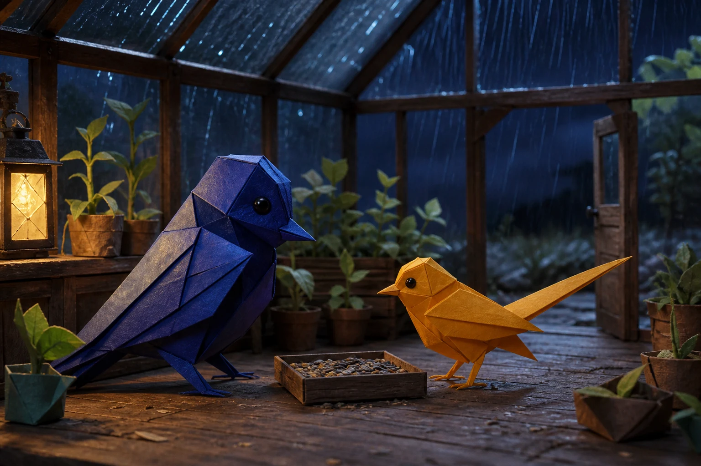
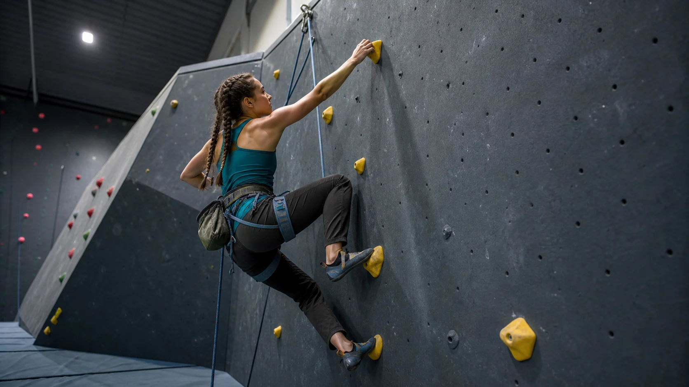
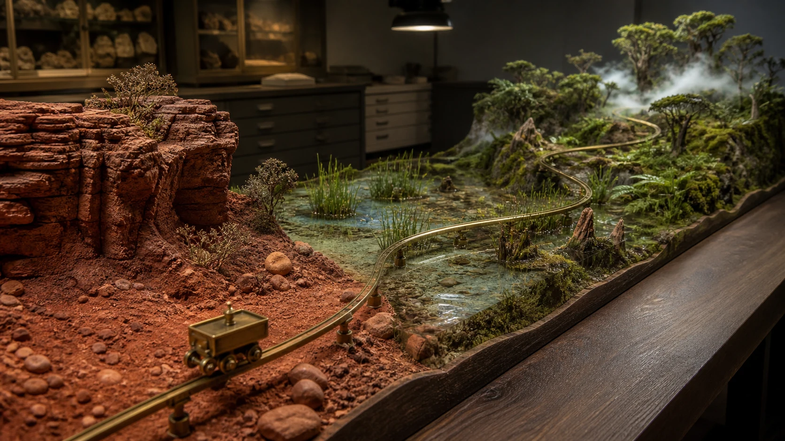

# Awesome MiniMax H3 Video Prompts — VideoWeb AI

Find a prompt for an ad, product shot, character scene or short film. Watch creator examples, then adapt the shot to your own project.

**84 prompt recipes · 24 categories · 15 community video examples**

**[Find a prompt](#choose-a-prompt) · [Watch examples](#watch-examples) · [Try a 5-second shot](#try-a-shot)**

**README languages:** [English](./README.md) · [简体中文](./README_zh.md) · [日本語](./README_ja.md) · [한국어](./README_ko.md) · [Español](./README_es.md) · [Français](./README_fr.md) · [Deutsch](./README_de.md) · [Português](./README_pt.md)

More resources: [All 24 categories](#full-catalog) · [11 reference images](#reference-images) · [Production templates](./templates/README.md) · [Deployment guide](./docs/deployment-guide.md)

**Contribute:** [Submit a prompt](https://github.com/aivideoweb/awesome-minimax-h3-prompts/issues/new?template=prompt-proposal.yml) · [Improve documentation](https://github.com/aivideoweb/awesome-minimax-h3-prompts/issues/new?template=documentation.yml) · [Open a pull request](https://github.com/aivideoweb/awesome-minimax-h3-prompts/pulls)



The full recipe library is in English, with [copy-ready samples in eight other languages](./docs/multilingual-prompting.md). Recipes and eleven reference images come from the upstream cookbook; VideoWeb adds the cover and browser guide. [Source and license](./UPSTREAM.md).

The 84 recipes were independently authored for the upstream cookbook. The 15 X community examples are separate learning references and do not count toward the 84 recipes or the 12 visual assets.

## What this cookbook helps you do

- Pick a complete recipe for an ad, product, character or location, then adapt it to your project.
- Assign each image, video and audio reference a role; specify timing, camera movement and sound.
- Keep characters, products and scenes consistent, then revise against the review checklist.
- Learn from community examples while separating author intent, sampled observations and unverified results.
- Organize delivery with production templates and share tested workflows through the [contribution guide](./CONTRIBUTING.md).

<a id="choose-a-prompt"></a>

## Choose a prompt by what you want to make

Read the recipe’s duration, input mode and reference map first. Many recipes need reference images or video and run longer than five seconds; adapt them to the free tool’s supported inputs and duration instead of pasting them unchanged.

| Your goal | Start here | First focus |
|---|---|---|
| Product or ad | [BRD-001](./prompts/01-brand-advertising.md#brd-001-midnight-observatory-tea-launch) | Product reveal with consistent shape and materials |
| Creator or lifestyle clip | [UGC-001](./prompts/03-ugc-lifestyle.md#ugc-001-desk-lamp-honest-first-impression) | Start with one clear product demonstration |
| Travel or location | [TRV-001](./prompts/04-travel-hospitality.md#trv-001-rain-washed-canal-town-morning) | Atmosphere and a restrained camera move |
| Animated character | [ANI-002](./prompts/08-animation-stylized.md#ani-002-clay-repair-robot-finds-a-button) | Character, action and prop continuity |
| Animated poster | [MOG-001](./prompts/22-motion-graphics-dynamic-posters.md#mog-001-night-market-poster-builds-on-the-beat) | Build the layout, then hold for reading |
| Multiple references or camera transfer | [MRF-002](./prompts/20-multireference-camera-transfer.md#mrf-002-radial-cork-speaker-transfer-motion-grammar-not-content) | Check video-reference support before preparing inputs |

[All 24 categories on this page](#full-catalog) · **[Browse all 84 recipes](./prompts/README.md)** · [Choose by deliverable or production risk](./docs/use-case-matrix.md)

<a id="try-a-shot"></a>

## Try your first 5-second shot

| What you need | VideoWeb entry |
|---|---|
| Try one shot without signing up | [Free MiniMax H3](https://videoweb.ai/free-minimax-h3/): the page lists 480p, 5 seconds, text or an optional start/end image pair |
| Regular production with available settings | [MiniMax H3 model page](https://videoweb.ai/model/minimax-h3/): confirm settings, credits and access before generating |

Open the free tool, leave the image fields empty, paste this example and choose an available aspect ratio. Review the bottle shape and camera motion, then change one issue at a time.

```text
A five-second single continuous shot of a fictional unbranded blue glass bottle on a dark studio plinth. 0–1 seconds: hold a medium close-up, bottle fully visible. 1–4 seconds: the camera slowly moves closer while a soft side light reveals the glass texture; the bottle remains still. 4–5 seconds: settle into a clean product frame. Keep bottle shape, cap, color and background unchanged. No cuts, rotation, added objects, lettering or logos. Sound intent: quiet studio ambience, no speech or music.
```

This untested starter is separate from the 84 upstream recipes. Page information was checked September 22, 2026; settings and queues may change. Image guidance needs a start/end pair; video or audio references require explicit tool support. See the [walkthrough and troubleshooting guide](./docs/videoweb-quick-start.md).

<a id="watch-examples"></a>

## Watch the video, read the author prompt

These are external creator examples, not test results of this cookbook or evidence of generation on VideoWeb. Click a preview for the X video; MP4, author prompt and field notes are linked separately.

The “Practice a similar technique” links at the end of each group lead to independent recipes and templates in this library, not the prompts used for the showcased videos. Each video’s “Prompt” link leads to the creator’s original prompt. Check required references and tool support before trying them.

**Browse by use case:** [Product and fashion ads](#examples-products) · [Characters and performance](#examples-characters) · [Motion and camera paths](#examples-motion) · [Typography and interfaces](#examples-graphics) · [Editing and storytelling](#examples-storytelling)

<a id="examples-products"></a>

### Product and fashion ads

| Headphone commercial: macro to exploded view | Blue-studio fashion: three references in one scene | Skincare campaign: night-to-morning continuity |
|---|---|---|
| [](https://x.com/LudovicCreator/status/2082783319075291312/video/1) | [](https://x.com/egeberkina/status/2083301476206588086/video/1) | [](https://x.com/AIwithJessica/status/2083013658230317082/video/1) |
| [@LudovicCreator](https://x.com/LudovicCreator) · [▶ MP4](https://video.twimg.com/ext_tw_video/2082783299395538944/pu/vid/avc1/1280x720/2lMmYGBjYKPRAZ8M.mp4?tag=12) · [Prompt](https://x.com/LudovicCreator/status/2082783319075291312) · [Notes](./docs/x-community-showcase.md#xh3-002) | [@egeberkina](https://x.com/egeberkina) · [▶ MP4](https://video.twimg.com/amplify_video/2083300689606852608/vid/avc1/2560x1440/fI84aXKhdEk3Fhp-.mp4?tag=29) · [Prompt](https://x.com/egeberkina/status/2083301476206588086) · [Notes](./docs/x-community-showcase.md#xh3-004) | [@AIwithJessica](https://x.com/AIwithJessica) · [▶ MP4](https://video.twimg.com/amplify_video/2083012032279064576/vid/avc1/2560x1440/vfNGJZk54lKChkX4.mp4?tag=29) · [Prompt](https://x.com/AIwithJessica/status/2083013658230317082) · [Notes](./docs/x-community-showcase.md#xh3-008) |
| **What to learn:** Four timed sections connect material detail, a rotating product, separated components and reassembly. The geometry constraints make this useful for studying product continuity. | **What to learn:** The prompt gives each reference a distinct actor and combines choreography with graphic overlays. Identity assets are required; the text alone is not a complete reproduction package. | **What to learn:** Track one product and person across changes in lighting, shot size and location; compare the final product frame with its earlier appearance. |
| **Check:** Generated internals are not evidence of real product construction. | **Check:** Reproduction needs rights-cleared identity references. | **Check:** The lighting is a fictional ad treatment, not evidence of skincare efficacy. |

**Practice a similar technique:** [Product materials](./prompts/02-product-ecommerce.md#prd-002-ceramic-diffuser-material-film) · [Fashion camera work](./prompts/06-fashion-beauty.md#fsh-001-wind-study-eyewear-editorial)


<a id="examples-characters"></a>

### Characters and performance

| Character entrance: detail to full silhouette | Bamboo-forest mystery: tension through close-ups | Japanese animation teaser: identity and expression control |
|---|---|---|
| [](https://x.com/aimikoda/status/2086412223061135392/video/1) | [](https://x.com/sipteaandcoffee/status/2083132770650571041/video/1) | [](https://x.com/haruuraeadss/status/2082945363431080299/video/1) |
| [@aimikoda](https://x.com/aimikoda) · [▶ MP4](https://video.twimg.com/amplify_video/2086412141729402880/vid/avc1/2160x2294/FS1GToZV1NqxgwuP.mp4?tag=29) · [Prompt](https://x.com/aimikoda/status/2086412223061135392) · [Notes](./docs/x-community-showcase.md#xh3-003) | [@sipteaandcoffee](https://x.com/sipteaandcoffee) · [▶ MP4](https://video.twimg.com/amplify_video/2083131917797556224/vid/avc1/2560x1440/IwY2cFJMAMZcOWT2.mp4?tag=29) · [Prompt](https://x.com/sipteaandcoffee/status/2083132770650571041) · [Notes](./docs/x-community-showcase.md#xh3-005) | [@haruuraeadss](https://x.com/haruuraeadss) · [▶ MP4](https://video.twimg.com/amplify_video/2082945330925240322/vid/avc1/2560x1440/pitGJm9RtfP57PFJ.mp4?tag=29) · [Prompt](https://x.com/haruuraeadss/status/2082945363431080299) · [Notes](./docs/x-community-showcase.md#xh3-015) |
| **What to learn:** A single identity reference anchors a progression from a small detail to body, expression and full silhouette. Reproduction requires a suitable character reference. | **What to learn:** Color, depth, lighting and shot/reverse-shot coverage carry the drama. The prompt constrains the period setting without supplying a timed dialogue script. | **What to learn:** Separate the character lock from permitted expression and gesture changes. The prompt also assigns camera changes to moments of discovery. |
| **Check:** The published layout includes a character sheet; its dimensions are not a native aspect-ratio setting. | **Check:** The original provides scene direction, not a timed dialogue script. | **Check:** Reproduction needs the character sheet; check identity and title spelling at full resolution. |

**Practice a similar technique:** [Subtle expression](./prompts/21-character-dialogue-performance.md#chr-002-the-first-new-root) · [Dialogue and reactions](./prompts/21-character-dialogue-performance.md#chr-003-bilingual-radio-repair-handoff)


<a id="examples-motion"></a>

### Motion and camera paths

| Ordinary footage, impossible event: a useful mismatch | Swimming sequence: distinguish four motion patterns | Cliffside chase: one continuous camera path |
|---|---|---|
| [](https://x.com/cocktailpeanut/status/2086879654116495564/video/1) | [](https://x.com/johnAGI168/status/2082798969499832514/video/1) | [](https://x.com/umesh_ai/status/2082499539735588916/video/1) |
| [@cocktailpeanut](https://x.com/cocktailpeanut) · [▶ MP4](https://video.twimg.com/amplify_video/2086878515744669696/vid/avc1/832x480/SWq-SdbO4yoiFzOO.mp4?tag=29) · [Prompt](https://x.com/cocktailpeanut/status/2086879654116495564) · [Notes](./docs/x-community-showcase.md#xh3-006) | [@johnAGI168](https://x.com/johnAGI168) · [▶ MP4](https://video.twimg.com/amplify_video/2082798728948125696/vid/avc1/2560x1440/jPepLvnPJuANFMKx.mp4?tag=29) · [Prompt](https://x.com/johnAGI168/status/2082798969499832514) · [Notes](./docs/x-community-showcase.md#xh3-010) | [@umesh_ai](https://x.com/umesh_ai) · [▶ MP4](https://video.twimg.com/amplify_video/2082499279680405504/vid/avc1/2560x1440/Zho0yGTsy043Peo5.mp4?tag=29) · [Prompt](https://x.com/umesh_ai/status/2082499539735588916) · [Notes](./docs/x-community-showcase.md#xh3-013) |
| **What to learn:** The brief delays its impossible event behind ordinary activity. This is useful for studying setup and surprise, alongside whether H3 follows the requested physical event. | **What to learn:** Use this as a motion-clarity study: inspect transitions and whether each action remains recognizable at the allotted speed. | **What to learn:** Study how obstacles motivate reframing while the moving subject supplies a continuous point of attention. The ending shifts from pursuit to a wide reveal. |
| **Check:** The sampled result shows a street and cloud wall, not the requested backyard and falling solid sky. | **Check:** Sampled frames cannot confirm correct swimming technique. | **Check:** Watch the full clip to check obstacle clearance and camera continuity. |

**Practice a similar technique:** [Continuous camera path](./prompts/20-multireference-camera-transfer.md#mrf-001-three-biome-museum-rail-in-one-take) · [Single-shot template](./templates/README.md#t01-text-to-video-single-readable-shot)


<a id="examples-graphics"></a>

### Typography and interfaces

| Kinetic typography: a quote becomes a story | Game interface: a readable turn-based sequence | Motion poster: assemble a layout without losing it |
|---|---|---|
| [](https://x.com/umesh_ai/status/2083909535593644291/video/1) | [](https://x.com/AllaAisling/status/2082909383424446745/video/1) | [](https://x.com/LudovicCreator/status/2083628852165672988/video/1) |
| [@umesh_ai](https://x.com/umesh_ai) · [▶ MP4](https://video.twimg.com/amplify_video/2083909175646785536/vid/avc1/2560x1440/L_Hs2kX2rOJqYZ8F.mp4?tag=29) · [Prompt](https://x.com/umesh_ai/status/2083909535593644291) · [Notes](./docs/x-community-showcase.md#xh3-001) | [@AllaAisling](https://x.com/AllaAisling) · [▶ MP4](https://video.twimg.com/amplify_video/2082909305062273024/vid/avc1/2560x1440/YHAv0vy5R_uIZnls.mp4?tag=29) · [Prompt](https://x.com/AllaAisling/status/2082909383424446745) · [Notes](./docs/x-community-showcase.md#xh3-011) | [@LudovicCreator](https://x.com/LudovicCreator) · [▶ MP4](https://video.twimg.com/ext_tw_video/2083628836285984768/pu/vid/avc1/720x1280/GfseYcSENCN1XmIr.mp4?tag=12) · [Prompt](https://x.com/LudovicCreator/status/2083628879407632890) · [Notes](./docs/x-community-showcase.md#xh3-014) |
| **What to learn:** The brief assigns successive phrases their own timing, visual scale and transition. Finish with a readable hold rather than continuous motion. | **What to learn:** Follow state changes: cards appear, one is selected, an action resolves, resources update, then the opposing turn begins. Check whether overlays stay anchored during camera changes. | **What to learn:** Treat the poster as layered components that enter in a deliberate order, then settle long enough to read. Preserve hierarchy rather than filling every region with movement. |
| **Check:** Check exact spelling and readable hold time. | **Check:** Some samples split the cards and scene into panels; check this against the intended full game interface. | **Check:** Check small text and layout drift at full size; requested duration and uploaded duration differ. |

**Practice a similar technique:** [Poster assembly](./prompts/22-motion-graphics-dynamic-posters.md#mog-001-night-market-poster-builds-on-the-beat) · [Feature-card layout](./prompts/22-motion-graphics-dynamic-posters.md#mog-002-modular-product-feature-cards)


<a id="examples-storytelling"></a>

### Editing and storytelling

| Beat-driven western title sequence | Suspense short: dialogue, reaction and sound reversal | Street-food vlog: place, preparation and reaction |
|---|---|---|
| [](https://x.com/doctorwasif/status/2085599659326935100/video/1) | **jump scare / flashing**<br>[](https://x.com/drjoetw/status/2082669221222207488/video/1) | [](https://x.com/nawalsehar/status/2085233880353915217/video/1) |
| [@doctorwasif](https://x.com/doctorwasif) · [▶ MP4](https://video.twimg.com/amplify_video/2085599599801077760/vid/avc1/1920x1080/aQ8Mx5ImZmjNxrZR.mp4?tag=29) · [Prompt](https://x.com/doctorwasif/status/2085599659326935100) · [Notes](./docs/x-community-showcase.md#xh3-007) | [@drjoetw](https://x.com/drjoetw) · [▶ MP4 — jump scare / flashing](https://video.twimg.com/amplify_video/2082668962203230208/vid/avc1/2560x1440/PQbFC3v78uE88LdE.mp4?tag=29) · [Prompt](https://x.com/drjoetw/status/2082669221222207488) · [Notes](./docs/x-community-showcase.md#xh3-009) | [@nawalsehar](https://x.com/nawalsehar) · [▶ MP4](https://video.twimg.com/amplify_video/2085233539185061888/vid/avc1/2560x1440/jgQLrvA-NHvBJBx_.mp4?tag=29) · [Prompt](https://x.com/nawalsehar/status/2085233880353915217) · [Notes](./docs/x-community-showcase.md#xh3-012) |
| **What to learn:** Study how held poses alternate with short action bursts, with titles reserved for strong musical accents. | **What to learn:** The sequence builds a question, follows a pointing gesture, then answers it through a reaction shot. Audio changes carry the tonal reversal. | **What to learn:** Compare wide location context, preparation detail and the tasting reaction; these serve different storytelling purposes. |
| **Check:** Sampled title lettering is malformed; repair it and verify beat timing in full playback. | **Check:** Jump scare / flashing. The prompt asks for 9:16; the uploaded video is 16:9. | **Check:** Generated locations and reactions are not documentary evidence or real testimonials. |

**Practice a similar technique:** [Multi-shot planning](./templates/README.md#t06-multi-shot-sequence-plan) · [Rhythm-guided editing](./templates/README.md#t10-audio--or-rhythm-guided-sequence)


See [all 15 cases with settings, sources and English/Chinese field notes](./docs/x-community-showcase.md).

Source records were checked September 20 and 22, 2026 through a public reader and sampled video frames, without regeneration or audio review. External works are outside the repository MIT license. [Evidence and sources](./docs/x-community-showcase.md#reading-the-evidence)

## Official MiniMax examples

The following previews are remotely referenced from and linked back to the official MiniMax-H3 repository. They are not stored in this repository and are not presented as outputs of this prompt library.

| Product advertising | 3D animation | Music video |
|---|---|---|
| [](https://github.com/MiniMax-AI/MiniMax-H3/tree/main/skills/minimalist-product-ad-generator) | [](https://github.com/MiniMax-AI/MiniMax-H3/tree/main/skills/3d-animation-short-generator) | [](https://github.com/MiniMax-AI/MiniMax-H3/tree/main/skills/mv-subtitle-skill-confirmed) |

Browse the [complete attributed official example gallery](./docs/official-h3-examples.md) for reproducible T2VA, FL2VA and Ref2VA request scripts, 768p MP4 outputs, and 2K workflow comparisons.

<a id="reference-images"></a>

## Choose a reference image

Click an image to open the original, then read its recipe and prepare the remaining inputs. These are starting-frame, ending-frame or mood references, not demonstrated video outputs or complete input packages.

### Products and advertising

| Reference image | Use and next step |
|---|---|
| [](./assets/gallery/midnight-observatory-tea.webp) | **Bottled-tea advertisement**<br><br>Product and location references; optional sound reference.<br><br>[Open recipe BRD-001](./prompts/01-brand-advertising.md#brd-001-midnight-observatory-tea-launch) |
| [](./assets/gallery/honest-desk-lamp-demo.webp) | **Desk-lamp demonstration**<br><br>Creator and product references; optional room tone.<br><br>[Open recipe UGC-001](./prompts/03-ugc-lifestyle.md#ugc-001-desk-lamp-honest-first-impression) |
| [](./assets/gallery/radial-cork-speaker.webp) | **Portable-speaker camera movement**<br><br>Also needs a camera-reference video, beat track and material detail images.<br><br>[Open recipe MRF-002](./prompts/20-multireference-camera-transfer.md#mrf-002-radial-cork-speaker-transfer-motion-grammar-not-content) |
| [](./assets/gallery/modular-lunch-jar-kit.webp) | **Lunch-jar product demonstration**<br><br>Needs product and presenter references, approved features and authorized voice.<br><br>[Open recipe VER-001](./prompts/24-vertical-series-live-creator.md#ver-001-honest-modular-lunch-jar-live-demo) |

### Characters and movement

| Reference image | Use and next step |
|---|---|
| [](./assets/gallery/clay-repair-robot.webp) | **Clay-robot animation**<br><br>Needs character turntable, workshop and movement references.<br><br>[Open recipe ANI-002](./prompts/08-animation-stylized.md#ani-002-clay-repair-robot-finds-a-button) |
| [](./assets/gallery/paper-birds-storm-shelter.webp) | **Paper-character dialogue**<br><br>Needs character/environment images, two authorized voices and storm ambience.<br><br>[Open recipe CHR-001](./prompts/21-character-dialogue-performance.md#chr-001-paper-birds-plan-for-the-storm) |
| [](./assets/gallery/indoor-climbing-final-hold.webp) | **Indoor-climbing movement**<br><br>Needs athlete, route and technique-video references; this image is not safety instruction.<br><br>[Open recipe ACT-001](./prompts/09-action-sports.md#act-001-indoor-climbing-final-move) |

### Scenes and motion graphics

| Reference image | Use and next step |
|---|---|
| [](./assets/gallery/rain-washed-canal-morning.webp) | **Fictional canal after rain**<br><br>The single-image exercise needs first-frame support; original TRV-001 requires three verified location images.<br><br>[Open single-image exercise](./docs/fictional-canal-starter.md) · [Open recipe TRV-001](./prompts/04-travel-hospitality.md#trv-001-rain-washed-canal-town-morning) |
| [](./assets/gallery/three-biome-museum-rail.webp) | **Miniature-scene continuous shot**<br><br>Needs a first frame and biome detail references; mechanical ambience is optional.<br><br>[Open recipe MRF-001](./prompts/20-multireference-camera-transfer.md#mrf-001-three-biome-museum-rail-in-one-take) |
| [](./assets/gallery/dynamic-night-market-poster.webp) | **Animated night-market poster**<br><br>Use this image as the target ending frame; original music is optional.<br><br>[Open recipe MOG-001](./prompts/22-motion-graphics-dynamic-posters.md#mog-001-night-market-poster-builds-on-the-beat) |
| [](./assets/gallery/topographic-map-archive.webp) | **Map-to-terrain transformation**<br><br>Needs a first frame, terrain detail images and room tone.<br><br>[Open recipe SRL-001](./prompts/23-surreal-physics-optical-illusions.md#srl-001-the-map-rises-into-a-landscape) |

To make your own references, use the [image briefs](./assets/minimax-h3-reference-image-prompts.md). See also the [asset and source records](./assets/README.md) and [VideoWeb cover record](./assets/videoweb-cover-prompt.md).

<a id="full-catalog"></a>

## Browse all 24 categories

| Collection | Recipes | Highlights |
|---|---:|---|
| [Brand and advertising](./prompts/01-brand-advertising.md) | 3 | Product launch, local campaign, multi-ratio adaptation |
| [Product and e-commerce](./prompts/02-product-ecommerce.md) | 3 | Feature demo, material film, 360° listing rotation |
| [UGC and lifestyle](./prompts/03-ugc-lifestyle.md) | 3 | Honest first impression, routine, packing test |
| [Travel and hospitality](./prompts/04-travel-hospitality.md) | 3 | Destination film, guesthouse reveal, market walkthrough |
| [Food and beverage](./prompts/05-food-beverage.md) | 3 | Bakery craft, noodle service, sparkling drink macro |
| [Fashion and beauty](./prompts/06-fashion-beauty.md) | 3 | Eyewear editorial, lip texture, four-look transition |
| [Cinematic storytelling](./prompts/07-cinematic-storytelling.md) | 3 | Unsent letter, train farewell, rooftop mystery |
| [Animation and stylized video](./prompts/08-animation-stylized.md) | 3 | Paper ecology, clay robot, ink transformation |
| [Action and sports](./prompts/09-action-sports.md) | 3 | Climbing, wet-circuit cycling, table tennis |
| [Fantasy, sci-fi and VFX](./prompts/10-fantasy-scifi-vfx.md) | 3 | Glasshouse stars, miniature water system, light dress |
| [UI, game and digital experience](./prompts/11-ui-game-digital.md) | 3 | App walkthrough, hardware UI, game inventory |
| [Transitions, comedy and social](./prompts/12-transitions-comedy-social.md) | 3 | Match cut, office plant comedy, laundromat alien |
| [Music, performance and audio-driven video](./prompts/13-music-performance-audio.md) | 4 | Live music, multilingual duet, dance, audio visualizer |
| [Education, documentary and science](./prompts/14-education-documentary-science.md) | 4 | Science explainer, museum object, safety procedure, microscopy |
| [Architecture, interiors and real estate](./prompts/15-architecture-interiors-real-estate.md) | 4 | Property tour, daylight study, renovation, smart home |
| [Automotive and mobility](./prompts/16-automotive-mobility.md) | 4 | Car interior, cargo bicycle, sleeper train, delivery robot |
| [Nature, animals and pets](./prompts/17-nature-animals-pets.md) | 4 | Wildlife, pet fit check, plant diary, tide-pool macro |
| [Industry, business and public service](./prompts/18-industry-business-public-service.md) | 4 | Assembly, cold chain, evacuation, bilingual service |
| [Editing, continuation and localization](./prompts/19-editing-continuation-localization.md) | 4 | Background cleanup, clip extension, localization, relighting |
| [Multi-reference and camera transfer](./prompts/20-multireference-camera-transfer.md) | 4 | One-take miniature, motion grammar, craft match actions, tutorial |
| [Character, dialogue and performance](./prompts/21-character-dialogue-performance.md) | 4 | Paper characters, restrained emotion, bilingual repair, ensemble scene |
| [Motion graphics and dynamic posters](./prompts/22-motion-graphics-dynamic-posters.md) | 4 | Poster assembly, feature cards, exhibition opener, material ident |
| [Surreal physics and optical illusions](./prompts/23-surreal-physics-optical-illusions.md) | 4 | Rising map, predictive shadow, future puddle, material sphere |
| [Vertical series and live creator](./prompts/24-vertical-series-live-creator.md) | 4 | Live demo, neighbor drama, repair series, creator answer |

## Guides and local deployment

| Your next task | Read |
|---|---|
| Refine motion, sound or character continuity | [Prompting guide](./docs/prompting-guide.md) · [12 production templates](./templates/README.md) |
| Write in another language | [Multilingual prompt samples](./docs/multilingual-prompting.md) |
| Understand the model and integration | [H3 overview](./docs/minimax-h3-overview.md) · [API workflow](./docs/api-workflow.md) |
| Run on your own hardware | [Nine-language deployment guide](./docs/deployment-guide.md) |
| Prepare reference images | [Image briefs](./assets/minimax-h3-reference-image-prompts.md) · [Asset records](./assets/README.md) |
| Compare other entry points | [Other H3 tools](./docs/other-h3-tools.md) |

## How to write and review an H3 prompt

MiniMax's official H3 materials highlight three areas: native multimodal understanding and generation across text, images, audio, and video; precise multimodal editing and control over people, objects, scenes, sound, and rhythm; and commercial content generation for film, advertising, e-commerce, digital experiences, games, and animation. See the [official MiniMax H3 capability examples](https://platform.minimaxi.com/docs/guides/video-prompt).

This library turns those capabilities into a repeatable prompt contract:

```text
Reference map: what each image, video, or audio input controls
Deliverable: channel, aspect ratio, duration target, audience, goal
Creative direction: scene, subject, story, style, light, color
Timeline: opening state → action beats → final state
Camera: framing, screen direction, movement, cut and transition rules
Continuity locks: identity, product, wardrobe, environment, UI, props
Sound intent: ambience, effects, dialogue or music role
Edit scope: what may change and what must remain untouched
Avoid: likely visual, physical, continuity, legal, and brand failures
```

The repository does not invent request parameters. See the [H3 overview and official resources](./docs/minimax-h3-overview.md), then confirm current model identifiers, supported inputs, limits, API fields, model license, and downloadable-release behavior in MiniMax's official documentation and model card.

### Review steps

1. Choose a recipe by the final deliverable and its biggest production risk.
2. Upload only the references you need and label each one by role.
3. Replace every `[bracketed variable]`; keep fictional placeholders or insert rights-cleared assets.
4. Adapt the timeline to the duration available in your H3 workflow.
5. Generate a structure pass before adding complex sound, typography, or effects.
6. Revise one failure class at a time: motion, identity, product, camera, text, or sound.
7. Review at normal speed, frame by frame, muted, and at final delivery size.

For multilingual work, start from the English canonical recipe and localize the complete specification. The [multilingual guide](./docs/multilingual-prompting.md) includes ready-to-copy examples in Simplified Chinese, Japanese, Korean, Spanish, French, German, Portuguese, and Arabic.

## Official resources and local deployment scope

- **Official H3 repository:** [MiniMax-AI/MiniMax-H3](https://github.com/MiniMax-AI/MiniMax-H3)
- **H3 model card and open weights:** [MiniMaxAI/MiniMax-H3](https://huggingface.co/MiniMaxAI/MiniMax-H3)
- **Local deployment guide:** [Nine-language deployment documentation](./docs/deployment-guide.md)
- **Official videos and skills:** [Attributed example gallery](./docs/official-h3-examples.md)
- **Official H3 capability examples:** [MiniMax video prompt guide](https://platform.minimaxi.com/docs/guides/video-prompt)
- **Hosted video workflow:** [MiniMax video generation guide](https://platform.minimaxi.com/docs/guides/video-generation)

The current release provides H3-Base FL2VA and Ref2VA weights for local 768p audiovisual generation. H3-Context-IR and H3-Regenerate-2K remain hosted components, so the full 2K workflow combines local generation with official APIs. Check the current Community License, supported tasks, runtime requirements, and release files before local or commercial use.

## Originality, rights, and safety

- Submit only original prompt text and rights-cleared inputs or outputs;
- Do not imitate a protected character, living artist, private person, campaign, product, or interface;
- Treat testimonials, ratings, prices, dates, performance claims, maps, and historical facts as verified data—not creative filler;
- Obtain consent and the necessary rights for identity, voice, music, brands, locations, and footage;
- Disclose generated or materially altered media where law or platform rules require it;
- Keep the exact model/tool, inputs, settings, date, edits, and known defects for published examples.

See the [originality policy](./docs/originality-policy.md), [CONTRIBUTING.md](./CONTRIBUTING.md), and the [asset production rules](./assets/README.md).

## Bring an original H3 workflow

Have a prompt that solved a real production problem? [Open the guided prompt proposal](https://github.com/aivideoweb/awesome-minimax-h3-prompts/issues/new?template=prompt-proposal.yml)—a polished video is welcome but not required. A strong submission explains the deliverable, reference roles, visible action, timing, continuity locks, sound intent, likely failure modes, and whether the recipe is conceptual or tested.

Good first contributions include testing an existing recipe, filling a practical scenario gap, improving a review checklist, adding a native-language adaptation, or reporting stale official documentation. Please read [CONTRIBUTING.md](./CONTRIBUTING.md); contributions must be original, rights-cleared, reproducible, and free of hidden promotional or tracking links.

[Report a documentation issue](https://github.com/aivideoweb/awesome-minimax-h3-prompts/issues/new?template=documentation.yml) · [Open a pull request](https://github.com/aivideoweb/awesome-minimax-h3-prompts/pulls)

## About VideoWeb AI

[VideoWeb AI](https://videoweb.ai) provides browser-based AI video and image creation tools. This repository is maintained as an open-source resource for practical multimodal video production.

This is an independent community project and is not endorsed by MiniMax. Product names belong to their respective owners.

## VideoWeb AI Affiliate Program

VideoWeb AI offers an [affiliate program](https://videoweb.ai/affiliate-program/) for developers, creators, reviewers, educators, and AI communities. After completing your profile and accepting the agreement, you can share a referral link and receive commission on eligible paid orders attributed to it. The current public offer is 20% on a referred user's first valid paid order and 10% on following valid paid orders within the 60-day attribution window. Rates, eligibility, attribution, refunds, and payment remain subject to the active affiliate agreement; participation does not guarantee earnings.

Read the [multilingual affiliate guide](./docs/affiliate-program.md) for joining steps, responsible-promotion rules, and disclosure text in nine languages.

## License

[MIT](./LICENSE) © 2026 Flaq AI; VideoWeb AI adaptations © 2026 aivideoweb · [Upstream](./UPSTREAM.md)
